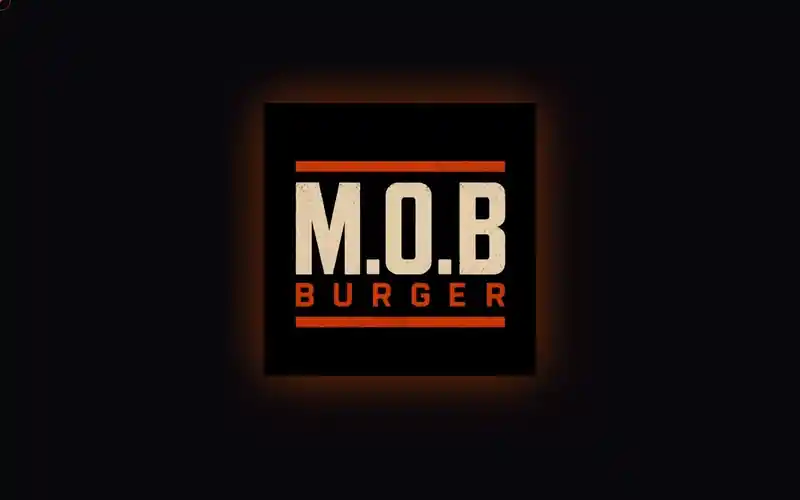

<div align="center">

<h1>🔥 M.O.B Burger — Landing Page</h1>

<p><strong>Vitrine de marca para uma hamburgueria artesanal — feita para virar pedido</strong></p>

<p>
  <a href="https://mob-burger-landing.vercel.app" target="_blank">
    
  </a>
</p>

<p>
  
  
  
  
  
  
</p>



</div>

---

## A ideia

Uma hamburgueria artesanal não compete por preço — compete por desejo. Esta landing existe para fazer o produto parecer tão bom quanto ele é e empurrar o visitante para um único lugar: **fazer o pedido**, direto, sem passar por marketplace nenhum.

Toda decisão visual serve a isso: fundo quase preto para a comida ser a única fonte de luz, tipografia condensada em caixa alta com gradiente de chama, e um CTA que acompanha o scroll do começo ao fim.

---

## ✨ Destaques de engenharia

**Animação com orçamento.** GSAP + ScrollTrigger conduzem intro, hero, reveals com pin e a galeria. Animação aqui é acabamento, não enfeite: cada trecho é disparado por scroll e desmontado quando sai de cena, sem timeline global rodando à toa.

**Direção de arte no CSS.** Os três níveis do hero (MURILO / ORIGINAL'S / BURGER) usam gradientes de chama — dourado → laranja → vermelho — aplicados como `background-clip: text`, sem uma imagem sequer. Texto continua texto: selecionável, acessível e nítido em qualquer densidade de tela.

**Peso onde importa.** Fontes servidas por `next/font` (Bebas Neue no display, DM Sans no corpo), com o custo visual concentrado nas fotos dos produtos — que são o argumento de venda.

**Cursor e microinterações próprios.** Cursor customizado, botões magnéticos, marquee contínuo e texto com efeito scramble dão à página uma identidade que um template não entrega.

---

## 🧩 Composição da página

| Seção | O que faz |
|---|---|
| **Intro** | Splash com logo e abertura em cortina |
| **Header** | Nav sticky com blur reativo ao scroll + menu mobile |
| **Hero** | MURILO / ORIGINAL'S / BURGER em gradiente de chama, com CTA e números da casa |
| **Marquee** | Faixa contínua com os argumentos da marca |
| **Burgers** | Carrossel dos produtos — scroll horizontal no mobile, GSAP no desktop |
| **Modal** | Foto e ingredientes do burger, com stagger na entrada |
| **Como pedir** | O caminho até o pedido, em passos |
| **Avaliações** | Prova social de clientes reais |
| **Galeria** | Feed visual no estilo Instagram |
| **CTA + Footer** | Chamada final, contato e WhatsApp flutuante |

---

## 🛠️ Stack

<table>
  <tbody>
    <tr>
      <td><strong>Framework</strong></td>
      <td> (App Router)  </td>
    </tr>
    <tr>
      <td><strong>Estilo</strong></td>
      <td>  </td>
    </tr>
    <tr>
      <td><strong>Animações</strong></td>
      <td> — ScrollTrigger, pin, stagger, scramble</td>
    </tr>
    <tr>
      <td><strong>Tipografia</strong></td>
      <td> display ·  corpo — via <code>next/font</code></td>
    </tr>
    <tr>
      <td><strong>Deploy</strong></td>
      <td> — auto-deploy a cada push em <code>main</code></td>
    </tr>
  </tbody>
</table>

---

## 🎨 Paleta

```css
--mob-black:   #08070B   /* fundo — a comida é a única luz */
--mob-surface: #100E17
--mob-card:    #17141F
--mob-fire:    #FF4500   /* CTA e destaques */
--mob-amber:   #FFB000
--mob-text:    #F0EAE0
--mob-muted:   #7A7180
```

---

## 🚀 Rodando localmente

```bash
git clone https://github.com/mateus-vitor-ferreira-dev/mob-burger-landing.git
cd mob-burger-landing
npm install
npm run dev    # http://localhost:3000
```

Sem variáveis de ambiente — a landing é estática por natureza.

---

<div align="center">
  <sub>Desenvolvido pela <strong>Codexa</strong> · <a href="https://github.com/mateus-vitor-ferreira-dev/mob-burger-web">Web app do projeto</a></sub>
</div>
